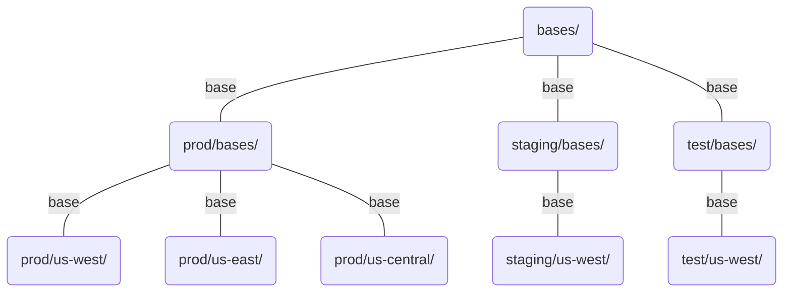


このドキュメントは [The Kubectl Book](https://kubectl.docs.kubernetes.io/) の翻訳です。翻訳の GitHub リポジトリは[こちら](https://github.com/FujiHaruka/kubectl-book-ja)。




**Content in this chapter is experimental and will evolve based on user feedback.**

Leave feedback on the conventions by creating an issue in the [kubectl](https://github.com/kubernetes/kubectl/issues)
GitHub repository.

Also provide feedback on new kubectl docs at the [survey](https://www.surveymonkey.com/r/JH35X82)





- ディレクトリの階層を分けることでリソース構成を構造化する
  - 環境とクラスタの[構成バリエーション](../app_customization/bases_and_variants.md)を分離するためにディレクトリを分離する



# ディレクトリ構造をベースとしたレイアウト

## 動機


この章ではディレクトリを使った方法を扱いますが、必要に応じてブランチとリポジトリを使う方法も併用してください。




この章で説明する方法は、デプロイするソースコードと同じリポジトリにリソース構成を置いても、別のリポジトリに切り分けても、どちらでも実行できます。



## ディレクトリ構想

| ディレクトリのタイプ | クラスタへのデプロイ           | 内容              | ディレクトリ名の例                             |
| ---------- | -------------------- | --------------- | ------------------------------------- |
| Base       | **No** - ベースとして使用    | 共有の構成           | `base/`                               |
| 環境         | **No** - 他のディレクトリを含む | ベースとクラスタのディレクトリ | `test/`, `staging/`, `prod/`          |
| クラスタ       | **Yes** - 手動 or 継続的  | デプロイ可能な構成       | `us-west1`, `us-east1`, `us-central1` |

### ベース

Kustomize ベース (例えば `bases:`) は `kustomization.yaml` をいくらか利用することでカスタマイズされた共有の構成を提供します。

この章で概説されるディレクトリ構造はベースを `app-bases/environment-bases/cluster` として階層化します。

## ワークフローの例

- *env/cluster/* に対して行われた変更は、**特定の環境-クラスタにのみ**ロールアウトされる
- *env>/bases/* に対して行われた変更は、**その環境のすべてのクラスタ**にロールアウトされる
- *bases/* に対して行われた変更は、**すべての環境のすべてのクラスタ**にロールアウトされる

## 図



### シナリオ

1. アリスは prod/us-west1 に変更 A を行う

- 変更は継続的デプロイメントによって prod 環境の us-west1 クラスタにプッシュされる

1. アリスは prod/bases に変更 B を行う

- 変更は継続的デプロイメントによって prod 環境のすべてのクラスタにプッシュされる

1. アリスは bases に変更 C を行う

- 変更は継続的デプロイメントによってすべてのクラスタにプッシュされる



participant Config in Git as B
participant Test Cluster as TC
participant Staging Cluster as SC
participant US West Prod Cluster as WC
participant US East Prod Cluster as EC

Note over B: Alice modifies prod/us-west1 with change A
B-->WC: A deployed

Note over B: Alice modifies prod/bases with change B
B-->EC: B deployed
B-->WC: B deployed

Note over B: Alice modifies bases/ with change C
B-->EC: C deployed
B-->TC: C deployed
B-->WC: C deployed
B-->SC: C deployed





テクニック:

- 各レイヤーには [namePrefix](../app_management/namespaces_and_names.md#setting-a-name-prefix-or-suffix-for-all-resources) と [commonLabels](../app_management/labels_and_annotations.md#setting-labels-for-all-resources) を追加する
- 各レイヤーにはラベルとアノテーションを追加する
- デプロイ可能な各対象は[名前空間](../app_management/namespaces_and_names.md#setting-the-namespace-for-all-resources)には設定する
- [Pod の環境変数と引数](../app_customization/customizing_pod_templates.md)を `configMapGenerator` の `behavior: merge` を使って上書きする
- カスタマイズの最後の微調整は [patch / overlay](../app_customization/customizing_arbitrary_fields.md) で行う

構造:

- 再利用可能な base は `*/bases/` 下に置く
  - `<project-name>/bases/`
  - `<project-name>/<environment>/bases/`
- デプロイ可能な対象は `<project-name>/<environment>/<cluster>/` 下に置く



```bash
tree
.
├── bases # Used as a Base only
│   ├── kustomization.yaml
│   ├── backend
│   │   ├── deployment.yaml
│   │   └── service.yaml
│   ├── frontend
│   │   ├── deployment.yaml
│   │   ├── ingress.yaml
│   │   └── service.yaml
│   └── storage
│       ├── service.yaml
│       └── statefulset.yaml
├── prod # Production
│   ├── bases 
│   │   ├── kustomization.yaml # Uses bases: ["../../bases"]
│   │   ├── backend
│   │   │   └── deployment-patch.yaml # Production Env specific backend overrides
│   │   ├── frontend
│   │   │   └── deployment-patch.yaml # Production Env specific frontend overrides
│   │   └── storage
│   │       └── statefulset-patch.yaml # Production Env specific storage overrides
│   ├── us-central
│   │   ├── kustomization.yaml # Uses bases: ["../bases"]
│   │   └── backend
│   │       └── deployment-patch.yaml # us-central cluster specific backend overrides
│   ├── us-east 
│   │   └── kustomization.yaml # Uses bases: ["../bases"]
│   └── us-west 
│       └── kustomization.yaml # Uses bases: ["../bases"]
├── staging # Staging
│   ├── bases 
│   │   ├── kustomization.yaml # Uses bases: ["../../bases"]
│   └── us-west 
│       └── kustomization.yaml # Uses bases: ["../bases"]
└── test # Test
    ├── bases 
    │   ├── kustomization.yaml # Uses bases: ["../../bases"]
    └── us-west 
        └── kustomization.yaml # Uses bases: ["../bases"]
```




ディレクトリ構造にはクラスタがパスに含まれますが、これは Apply 時にクラスタのコンテキストを決定するために使われはしません。特定のクラスタを Apply するには、そのクラスタを kubectl 設定に追加し、Apply 実行時に対応するコンテキストを指定します。

詳細は[マルチクラスタ](accessing_multiple_clusters.md)を参照。




git のホスティングサービスには、きめ細かい権限モデルを提供っするために**コードオーナー**を設定できるものがあります。コードオーナーは分離された各環境 (たとえば dev、test、prod) のために権限を分離するためにも利用できます。



## ロールバックの図



participant Config in Git as B
participant Test Cluster as TC
participant Staging Cluster as SC
participant US West Prod Cluster as WC
participant US East Prod Cluster as EC

Note over B: Bob modifies bases/ with change B
B-->EC: B deployed
B-->SC: B deployed
B-->WC: B deployed
Note over B,EC: Prod Outage caused by B
B-->TC: B deployed
Note over B: Bob rolls back bases/ git commits to A
B-->WC: A deployed
B-->TC: A deployed
B-->EC: A deployed
Note over B,EC: Prod Outage resolved
B-->SC: A deployed


