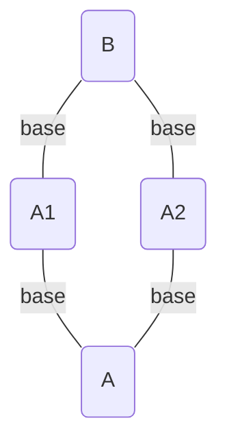


このドキュメントは [The Kubectl Book](https://kubectl.docs.kubernetes.io/) の翻訳です。翻訳の GitHub リポジトリは[こちら](https://github.com/FujiHaruka/kubectl-book-ja)。




**Content in this chapter is experimental and will evolve based on user feedback.**

Leave feedback on the conventions by creating an issue in the [kubectl](https://github.com/kubernetes/kubectl/issues)
GitHub repository.

Also provide feedback on new kubectl docs at the [survey](https://www.surveymonkey.com/r/JH35X82)





- 同一プロジェクト内で同一のベースを異なるアプリケーションに対して複数回使うことができる



# 共有ベースによる合成

## 動機

**同じ Apply により管理されるプロジェクト内で、同一のベースを複数回**、再利用したくなることがあります。たとえば、

- 非常に汎用的なベース ("Java Application" など) を定義し、一つのプロジェクト内で複数のアプリケーションに使用する
- 一つのプロジェクト内に複数の環境 (Staging、Canary、Prod) を定義する

## 共有ベースによる合成





同一プロジェクト内で同じベースを複数回使用するには、3 層構造を使ってベースのバリエーションを複数合成します。

1. `kustomization.yaml` 中の汎用的なベース
2. 複数の `kustomization.yaml` の汎用的ベースのバリエーション
3. 複数のベースとしてのバリエーションを一つの `kustomization.yaml` に合成する

各レイヤーには前段のレイヤーに対するカスタマイズやリソースを追加できます。

汎用的なベースレイヤー: **../base/java**

- Java アプリケーションのベースとなる Deployment を定義
- Java アプリケーションのベースとなる Service を定義

バリエーションレイヤー: **../app1/ + ../app2/**

- 汎用的なベースの継承
- namePrefix を設定
- ラベルとセレクタを設定
- ベース上のイメージを Overlay
- イメージタグを設定

合成レイヤー: **kustomization.yaml**

- 2 つのアプリケーションをベースとして合成
- プロジェクト内のリソースに名前空間を設定
- プロジェクト内のリソースに namePrefix を設定



**汎用的ベースレイヤー:**

```yaml
# base/java/kustomization.yaml
resources:
- deployment.yaml
- service.yaml
```

```yaml
# base/java/deployment.yaml
apiVersion: apps/v1
kind: Deployment
metadata:
  labels:
    app: java
  name: java
spec:
  selector:
    matchLabels:
      app: java
  template:
    metadata:
      labels:
        app: java
    spec:
      containers:
      - image: java
        name: java
        ports:
        - containerPort: 8010
        livenessProbe:
          httpGet:
            path: /health
            port: 8010
          initialDelaySeconds: 30
          timeoutSeconds: 1
        readinessProbe:
          httpGet:
            path: /ready
            port: 8010
          initialDelaySeconds: 30
          timeoutSeconds: 1
```

```yaml
# base/java/service.yaml
kind: Service
apiVersion: v1
metadata:
  name: java
spec:
  selector:
    app: app
  ports:
  - protocol: TCP
    port: 8080
    targetPort: 8080
```

**バリエーションレイヤー 1 と 2:**

```yaml
# app1/kustomization.yaml
namePrefix: 1-
commonLabels:
  app: app1
bases:
- ../base/java
patchesStrategicMerge:
- overlay.yaml
images:
  - name: myapp1
    newTag: v2
```

```yaml
# app1/overlay.yaml
apiVersion: apps/v1
kind: Deployment
metadata:
  name: java
spec:
  template:
    spec:
      containers:
      - image: myapp1
        name: java
```

```yaml
# ../app2/kustomization.yaml
namePrefix: 2-
commonLabels:
  app: app2
bases:
- ../base/java
patchesStrategicMerge:
- overlay.yaml
images:
  - name: myapp2
    newTag: v1
```

```yaml
# app2/overlay.yaml
apiVersion: apps/v1
kind: Deployment
metadata:
  name: java
spec:
  template:
    spec:
      containers:
      - image: myapp2
        name: java
```

**合成レイヤー:**

```yaml
# kustomization.yaml
namePrefix: app-
namespace: app
bases:
- app1
- app2
```





**結果**:

- 2 つの Deployment が作成される
- 各 Deployment は異なるイメージをもつ
- 各 Deployment は異なるラベル / セレクタをもつ
- 各 Deployment は異なる異なる名前をもつ
- 2 つの Service が作成される
- 各 Service は異なるセレクタをもち、別々の Deployment にマッチする
- すべてのリソース名は同じ接頭辞を共有する
- すべてのリソースは同じ名前空間を共有する

**要約**

- ほとんどの複雑性は共有のベースに押し込められる
- チーム間、組織間の慣習は共通ベースに基準がある
- ベースのバリエーションは互いに非常に似ており、バリエーション用におあつらえの部品に修正できる - イメージ、引数など
- バリエーションは合成され、プロジェクトワイドな慣習が適用される一つのプロジェクトを形成する

**利点**

- 変更を下流のベースに伝播させることによってメンテナンスの労力を減らす
- 関心の分離によってバリエーションの複雑を減らす



**適用:**

```yaml
apiVersion: v1
kind: Service
metadata:
  # name has both app1 and project kustomization.yaml namePrefixes
  name: app-1-java
  # namespace updated by namespace in project kustomization.yaml
  namespace: app
  # labels updated by commonLabels in app1 kustomization.yaml
  labels:
    app: app1
spec:
  ports:
  - port: 8080
    protocol: TCP
    targetPort: 8080
  # selector updated by commonLabels in app1 kustomization.yaml
  selector:
    app: app1
---
apiVersion: v1
kind: Service
metadata:
  # name has both app2 and project kustomization.yaml namePrefixes
  name: app-2-java
  # namespace updated by namespace in project kustomization.yaml
  namespace: app
  # labels updated by commonLabels in app2 kustomization.yaml
  labels:
    app: app2
spec:
  ports:
  - port: 8080
    protocol: TCP
    targetPort: 8080
  # selector updated by commonLabels in app2 kustomization.yaml
  selector:
    app: app2
---
apiVersion: apps/v1
kind: Deployment
metadata:
  # namespace updated by namespace in project kustomization.yaml
  namespace: app
  # name has both app1 and project kustomization.yaml namePrefixes
  name: app-1-java
  # labels updated by commonLabels in app1 kustomization.yaml
  labels:
    app: app1
spec:
  # selector updated by commonLabels in app1 kustomization.yaml
  selector:
    matchLabels:
      app: app1
  template:
    metadata:
      # labels updated by commonLabels in app1 kustomization.yaml
      labels:
        app: app1
    spec:
      containers:
      # Image is updated by Overlay
      # ImageTag is updated by images in app1 kustomization.yaml
      - image: myapp1:v2
        name: java
        # ports and probes inherited from the base
        ports:
        - containerPort: 8010
        livenessProbe:
          httpGet:
            path: /health
            port: 8010
          initialDelaySeconds: 30
          timeoutSeconds: 1
        readinessProbe:
          httpGet:
            path: /ready
            port: 8010
          initialDelaySeconds: 30
          timeoutSeconds: 1
---
apiVersion: apps/v1
kind: Deployment
metadata:
  # namespace updated by namespace in project kustomization.yaml
  namespace: app
  # name has both app2 and project kustomization.yaml namePrefixes
  name: app-2-java
  # labels updated by commonLabels in app2 kustomization.yaml
  labels:
    app: app2
spec:
  # selector updated by commonLabels in app2 kustomization.yaml
  selector:
    matchLabels:
      app: app2
  template:
    metadata:
      # labels updated by commonLabels in app2 kustomization.yaml
      labels:
        app: app2
    spec:
      containers:
      # Image is updated by Overlay
      # ImageTag is updated by images in app2 kustomization.yaml
      - image: myapp2:v1
        name: java
        # ports and probes inherited from the base
        ports:
        - containerPort: 8010
        livenessProbe:
          httpGet:
            path: /health
            port: 8010
          initialDelaySeconds: 30
          timeoutSeconds: 1
        readinessProbe:
          httpGet:
            path: /ready
            port: 8010
          initialDelaySeconds: 30
          timeoutSeconds: 1
```





- アプリケーションごとの汎用的な Archetype ベースを定義する
- メタプロジェクトに一緒にプッシュされる複数のプロジェクトを合成する


