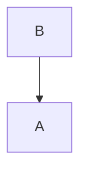
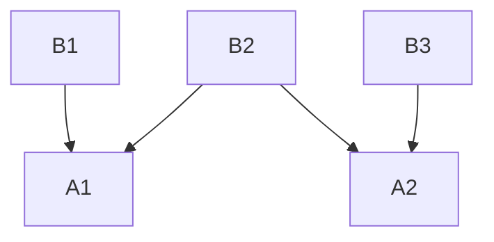
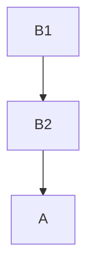


**Provide feedback at the [survey](https://www.surveymonkey.com/r/C855WZW)**





- `kustomization.yaml` の構成を Base としたリソース構成の再利用
- 複数の環境向けに Base をカスタマイズする
- 複数のプロジェクトをまたいだ Base の再利用



# Base とバリエーション

## 動機

ユーザーが**一つのリソース構成を変形して**複数の構成をデプロイしたり、**同じリソース構成を再利用**したりすることはよくあります。
`kustomization.yaml` によって作成されたリソース構成は、`kustomization.yaml` を **Base** として使い、複数のプロジェクトをまたいで再利用することができます。

例。

- **dev、test、staging、canary、production 環境**にデプロイされるプロジェクトで、各環境で設定が違っている
- **複数のクラスタ**にデプロイされるプロジェクトで、各クラスタでプロジェクトの設定やバージョンが異なっている



- [bases](../reference/kustomize.md#bases)

 

## Base

Base は `kustomization.yaml` の中で共有されるリソース構成で、別の `kustomization.yaml` が利用したりカスタマイズしたりします。

Base の例。

- Common Java Base
  - 複数のアプリで使用 (ゲストブック、カレンダー、認証など)
- Common Guest Book App Base
  - 複数の環境で使用 (test、staging、production など)
- Common Prod Guest Book App Base
  - 複数のクラスタで使用 (us-west、us-east、us-canary など)

## Base への参照

プロジェクトに Base を追加するには、別の `kustomization.yaml` があるディレクトリのパス (`kustomization.yaml` への相対パス) を **`base`** に追加します。これによって、ベースプロジェクトから現プロジェクトにすべてのリソースが自動的に追加、kustomize されます。

Base の取りうる値は以下です。

- `kustomization.yaml` からの相対パス - たとえば `..base`
- URL - たとえば `github.com/kubernetes-sigs/kustomize/examples/multibases?ref=v1.0.6`

### 図

一つの Base が一つのアプリケーションに継承される



共有 Base が異なるアプリケーションに継承される





**例:** `kustomization.yaml` を Base として追加する



**入力:** kustomization.yaml ファイル

```yaml
# kustomization.yaml
bases:
- ../base
```

**Base:** kustomization.yaml とリソース構成

```yaml
# ../base/kustomization.yaml
configMapGenerator:
- name: my-java-server-env-vars
  literals:	
  - JAVA_HOME=/opt/java/jdk
  - JAVA_TOOL_OPTIONS=-agentlib:hprof
resources:
- deployment.yaml
```

```yaml
# ../base/deployment.yaml
apiVersion: apps/v1
kind: Deployment
metadata:
  labels:
    app: nginx
  name: nginx-deployment
spec:
  selector:
    matchLabels:
      app: nginx
  template:
    metadata:
      labels:
        app: nginx
    spec:
      containers:
      - image: nginx
        name: nginx
        volumeMounts:
        - mountPath: /etc/config
          name: config-volume
      volumes:
      - configMap:
          name: my-java-server-env-vars
        name: config-volume
```

**適用:** クラスタに適用されるリソース

```yaml
# Unmodified Generated Base Resource
apiVersion: v1
kind: ConfigMap
metadata:
  name: my-java-server-env-vars-k44mhd6h5f
data:
  JAVA_HOME: /opt/java/jdk
  JAVA_TOOL_OPTIONS: -agentlib:hprof
---
# Unmodified  Config Resource
apiVersion: apps/v1
kind: Deployment
metadata:
  labels:
    app: nginx
  name: nginx-deployment
spec:
  selector:
    matchLabels:
      app: nginx
  template:
    metadata:
      labels:
        app: nginx
    spec:
      containers:
      - image: nginx
        name: nginx
        volumeMounts:
        - mountPath: /etc/config
          name: config-volume
      volumes:
      - configMap:
          name: my-java-server-env-vars-k44mhd6h5f
        name: config-volume
```




Base 自体にもバリエーションとその Base を作れます。
詳細は [Advanced Composition](../app_composition_and_deployment/structure_multi_tier_apps.md) をご覧ください。




